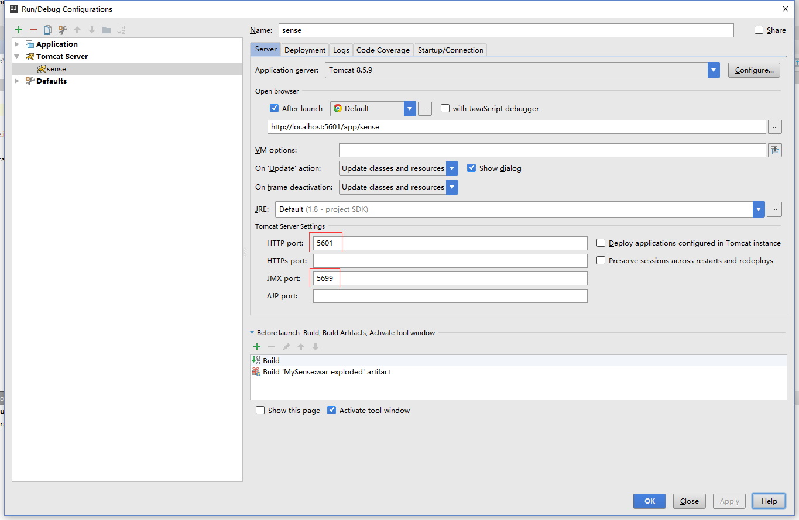
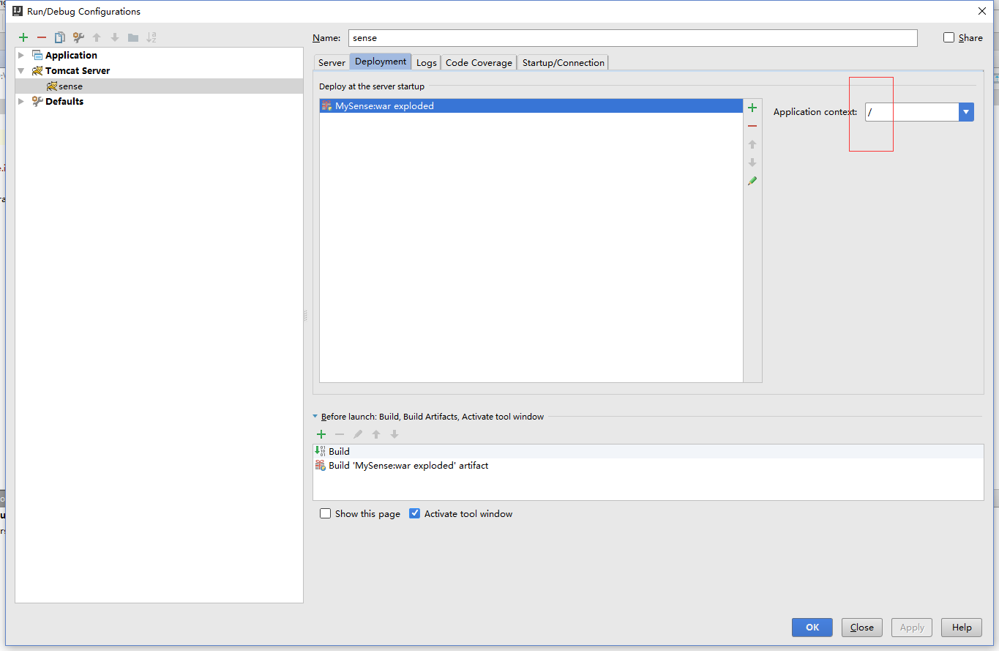

# MySense  

在跟着[elasticsearch官网中文文档](https://www.elastic.co/guide/cn/elasticsearch/guide/current/index.html)学习的过程中，sense无法安装成功，所以就自行开发了这个项目用于方便测试  

在idea中tomcat的配置如下：  
  
  

部署运行成功后，启动elasticsearch，然后在浏览器中打开如下地址：  
[http://localhost:5601/app/sense  ](http://localhost:5601/app/sense)  
或者  
[http://localhost:5601/app/sense/?load_from=https://www.elastic.co/guide/cn/elasticsearch/guide/current/snippets/010_Intro/30_Get.json](http://localhost:5601/app/sense/?load_from=https://www.elastic.co/guide/cn/elasticsearch/guide/current/snippets/010_Intro/30_Get.json)    
可以看到运行效果  
在官方文档中点击“在SENSE中查看”按钮就是打开第二种连接  


elasticsearch服务地址可以在  
[property/elasticSearchCfg.properties](src/main/resources/property/elasticSearchCfg.properties)  
中修改
```
root=http://localhost:9200
```
